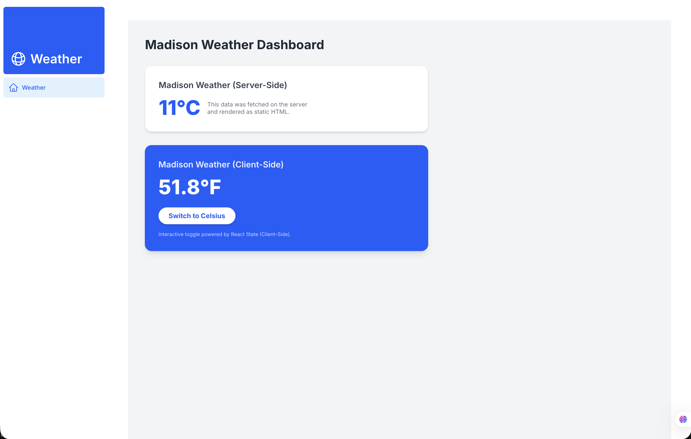

# Madison Weather Dashboard

A weather dashboard for Madison, Wisconsin, built with Next.js, React, TypeScript, and Tailwind CSS.

The application fetches temperature forecast data from the 7Timer API on the server and lets users switch between Celsius and Fahrenheit through an interactive client component.
## Screenshot



## Features

- Weather forecast data for Madison, Wisconsin
- Celsius and Fahrenheit toggle
- Server-side API fetching
- Loading state while forecast data is fetched
- Error message when weather data cannot be loaded
- API request timeout
- Responsive layout
- Page title and description metadata

## Tech Stack

- Next.js App Router
- React
- TypeScript
- Tailwind CSS
- Heroicons
- 7Timer API

## Getting Started

### 1. Clone the repository

```bash
git clone https://github.com/ugursalih/nextjs-dashboard.git
cd nextjs-dashboard
```

### 2. Install dependencies

```bash
npm install
```

### 3. Start the development server

```bash
npm run dev
```

Open http://localhost:3000 in your browser.

No API key or environment variables are required.

## Available Commands

| Command | Description |
| --- | --- |
| `npm run dev` | Start the development server |
| `npm run lint` | Run ESLint |
| `npm run build` | Create a production build |
| `npm start` | Run the production server after building |

## How It Works

1. The home page redirects to `/dashboard`.
2. The dashboard requests forecast data from the 7Timer API.
3. The first forecast entry supplies the temperature in Celsius.
4. A client component converts the temperature to Fahrenheit when requested.
5. Failed requests or invalid temperature data display an error message.

## Data Source and Limitations

Weather forecasts are provided by [7Timer](https://www.7timer.info/).

The displayed temperature comes from a forecast entry, not a real-time weather observation. The location is fixed to Madison, Wisconsin, and data availability depends on the external API.

## What I Practiced

- Using the Next.js App Router
- Working with server and client components
- Fetching and validating external API data
- Managing interactive UI state with React
- Handling loading states and request failures
- Styling responsive interfaces with Tailwind CSS

## Project Background

This project began as a dashboard learning exercise and was adapted into a weather application.